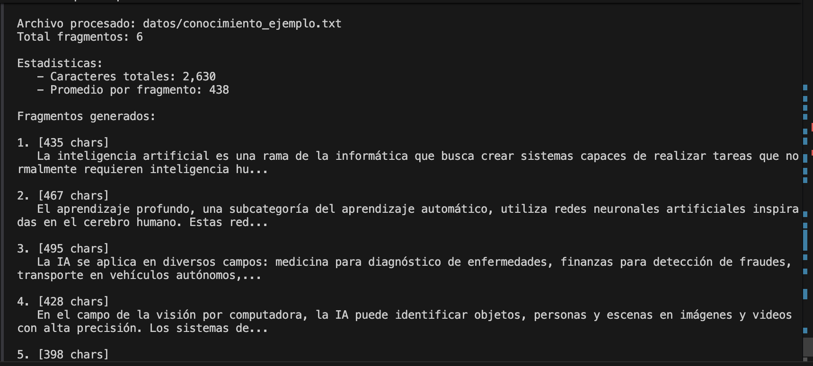

# Sistema RAG (Retrieval-Augmented Generation)

## Descripción

Sistema de Recuperación Aumentada por Generación implementado con LangChain, OpenAI y Pinecone. Este proyecto proporciona una arquitectura modular para el procesamiento de documentos, generación de embeddings vectoriales y consultas basadas en contexto mediante modelos de lenguaje.


## Arquitectura

El sistema RAG implementa un pipeline de procesamiento de información dividido en tres componentes principales:

1. **Procesamiento de Documentos**: Carga y división de documentos en fragmentos (chunks) mediante estrategias de solapamiento.
2. **Generación de Embeddings**: Conversión de texto en representaciones vectoriales utilizando modelos de OpenAI.
3. **Recuperación y Generación**: Búsqueda semántica en bases de datos vectoriales y generación de respuestas contextualizadas.


## Requisitos del Sistema

### Software

- Python 3.13 o superior
- pip (gestor de paquetes de Python)
- Entorno virtual (venv recomendado)

### Dependencias Principales

| Librería | Versión | Propósito |
|----------|---------|-----------|
| langchain | >= 0.3.0 | Framework principal RAG |
| langchain-openai | >= 0.2.0 | Integración con OpenAI |
| langchain-pinecone | >= 0.2.0 | Integración con Pinecone |
| openai | >= 1.50.0 | API de OpenAI |
| pinecone | >= 5.0.0 | Base de datos vectorial |
| chromadb | >= 0.5.0 | Almacenamiento vectorial local |
| pydantic | >= 2.5.0 | Validación de configuración |

### Claves API (Opcional)

- OpenAI API Key: Para generación de embeddings y respuestas
- Pinecone API Key: Para almacenamiento vectorial en la nube

**Nota**: El sistema puede ejecutarse en modo de prueba sin claves API para procesamiento de documentos.

## Instalación

### 1. Clonar el Repositorio

```bash
git clone xx
cd xx
```

### 2. Crear Entorno Virtual

```bash
python3 -m venv venv
source venv/bin/activate  # En Windows: venv\Scripts\activate
```

### 3. Instalar Dependencias

```bash
pip install -r requirements.txt
```

### 4. Verificar Instalación

```bash
python test_basico.py
```


## Configuración

### Archivo de Configuración

Crear archivo `.env` en el directorio raíz:

```bash
cp .env.example .env
```

### Variables de Entorno

```env
# OpenAI Configuration
OPENAI_API_KEY=sk-your-key-here
OPENAI_MODEL=gpt-3.5-turbo
OPENAI_EMBEDDING_MODEL=text-embedding-ada-002

# Pinecone Configuration
PINECONE_API_KEY=your-pinecone-key
PINECONE_ENVIRONMENT=gcp-starter
PINECONE_INDEX_NAME=rag-knowledge-base

# Processing Configuration
CHUNK_SIZE=1000
CHUNK_OVERLAP=200
TEMPERATURE=0.0
MAX_TOKENS=2000
```

## Estructura del Proyecto

```
ivan/
├── configuracion/
│   ├── __init__.py
│   └── ajustes.py
├── nucleo/
│   ├── __init__.py
│   ├── procesador_documentos.py
│   ├── generador_embeddings.py
│   └── motor_lenguaje.py
├── servicios/
│   ├── __init__.py
│   ├── almacen_vectores.py
│   ├── gestor_pinecone.py
│   └── cadena_rag.py
├── datos/
│   └── conocimiento_ejemplo.txt
├── resources/
│   ├── 1.png
│   ├── 2.png
│   ├── 3.png
│   └── 4.png
├── main.py
├── requirements.txt
├── .env.example
├── .gitignore
└── README.md
```

## Uso

### Modo API Keys

Para pruebas de procesamiento de documentos sin necesidad de claves API:


### Modo Con API Keys

Para funcionalidad completa RAG con generación de respuestas:

```bash
source venv/bin/activate

# Configurar claves (primera vez)
cp .env.example .env
nano .env  # Editar con sus credenciales

# Ejecutar ejemplo completo
python ejemplo_completo.py

# Modo interactivo
python main.py
```



## Ejemplos

### Ejemplo 1: Procesamiento de Documentos Locales

```python
from nucleo import ProcesadorDocumentos

procesador = ProcesadorDocumentos(tamano_chunk=500, solapamiento=100)
fragmentos = procesador.procesar_texto_completo("datos/conocimiento_ejemplo.txt")

print(f"Total de fragmentos: {len(fragmentos)}")
print(f"Primer fragmento: {fragmentos[0].page_content[:200]}...")
```

**Salida esperada:**
```
Total de fragmentos: 6
Primer fragmento: La inteligencia artificial es una rama de la informática...
```

### Ejemplo 2: Procesamiento de Contenido Web

```python
from langchain_community.document_loaders import WebBaseLoader
from nucleo import ProcesadorDocumentos

loader = WebBaseLoader("https://es.wikipedia.org/wiki/Inteligencia_artificial")
docs = loader.load()

procesador = ProcesadorDocumentos(tamano_chunk=500, solapamiento=100)
fragmentos = procesador.dividir_documentos(docs)

print(f"Caracteres descargados: {len(docs[0].page_content):,}")
print(f"Fragmentos generados: {len(fragmentos)}")
```

### Ejemplo 3: Sistema RAG Completo

```python
from configuracion import ConfiguracionAmbiente
from nucleo import ProcesadorDocumentos, GeneradorEmbeddings, MotorLenguaje
from servicios import GestorPinecone, CadenaRAG

# Cargar configuración
config = ConfiguracionAmbiente.cargar_desde_ambiente()
config.configurar_ambiente()

# Inicializar componentes
procesador = ProcesadorDocumentos(config.chunk_size, config.chunk_overlap)
embeddings = GeneradorEmbeddings(config.openai_embedding_model)
llm = MotorLenguaje(config.openai_model, config.temperature, config.max_tokens)

# Procesar documentos
fragmentos = procesador.procesar_texto_completo("datos/conocimiento_ejemplo.txt")

# Configurar Pinecone
gestor = GestorPinecone(config.pinecone_api_key, config.pinecone_index_name)
gestor.crear_indice()
gestor.cargar_documentos(fragmentos, embeddings.obtener_instancia())

# Crear cadena RAG
retriever = gestor.obtener_retriever(k=4)
cadena = CadenaRAG(llm.obtener_instancia(), retriever)

# Realizar consulta
resultado = cadena.consultar("¿Qué es la inteligencia artificial?")
print(f"Respuesta: {resultado['result']}")
print(f"Documentos consultados: {len(resultado['source_documents'])}")
```

### Ejemplo 4: Almacenamiento Local con Chroma

```python
from nucleo import ProcesadorDocumentos, GeneradorEmbeddings
from servicios import AlmacenVectores

procesador = ProcesadorDocumentos(tamano_chunk=500, solapamiento=100)
fragmentos = procesador.procesar_texto_completo("datos/conocimiento_ejemplo.txt")

embeddings = GeneradorEmbeddings()
almacen = AlmacenVectores(embeddings.obtener_instancia(), "./chroma_db")
almacen.agregar_documentos(fragmentos)

resultados = almacen.buscar_similitud("inteligencia artificial", k=3)
for i, doc in enumerate(resultados, 1):
    print(f"{i}. {doc.page_content[:100]}...")
```

## Documentación Técnica

### Componentes del Sistema

#### 1. ConfiguracionAmbiente

Gestiona la configuración del sistema mediante Pydantic para validación de tipos.

**Métodos principales:**
- `cargar_desde_ambiente()`: Carga configuración desde archivo `.env`
- `configurar_ambiente()`: Establece variables de entorno del sistema

#### 2. ProcesadorDocumentos

Procesa documentos de múltiples fuentes y los divide en fragmentos manejables.

**Métodos principales:**
- `cargar_desde_archivo(ruta)`: Carga documentos locales
- `cargar_desde_web(urls)`: Extrae contenido de URLs
- `dividir_documentos(docs)`: Divide en chunks con solapamiento
- `procesar_texto_completo(ruta)`: Pipeline completo para archivos
- `procesar_web_completo(urls)`: Pipeline completo para web

#### 3. GeneradorEmbeddings

Genera representaciones vectoriales del texto usando modelos de OpenAI.

**Métodos principales:**
- `obtener_instancia()`: Retorna instancia de OpenAIEmbeddings

#### 4. MotorLenguaje

Interface para modelos de lenguaje de OpenAI (GPT-3.5, GPT-4).

**Métodos principales:**
- `obtener_instancia()`: Retorna instancia del LLM configurado

#### 5. AlmacenVectores

Gestiona almacenamiento vectorial local usando ChromaDB.

**Métodos principales:**
- `agregar_documentos(docs)`: Almacena documentos
- `buscar_similitud(query, k)`: Búsqueda semántica
- `obtener_retriever(k)`: Retorna retriever para RAG

#### 6. GestorPinecone

Gestiona índices en Pinecone para almacenamiento vectorial distribuido.

**Métodos principales:**
- `crear_indice(dimension, metrica)`: Crea índice en Pinecone
- `cargar_documentos(docs, embeddings)`: Carga documentos al índice
- `conectar_indice(embeddings)`: Conecta a índice existente
- `buscar_similitud(query, k)`: Búsqueda en Pinecone
- `obtener_retriever(k)`: Retorna retriever configurado

#### 7. CadenaRAG

Implementa el pipeline completo de RAG usando LCEL (LangChain Expression Language).

**Métodos principales:**
- `consultar(pregunta)`: Ejecuta consulta RAG completa
- `modo_interactivo()`: Interface de línea de comandos


## Referencias

- LangChain Documentation: https://python.langchain.com/
- OpenAI API Reference: https://platform.openai.com/docs/
- Pinecone Documentation: https://docs.pinecone.io/
- ChromaDB Documentation: https://docs.trychroma.com/
